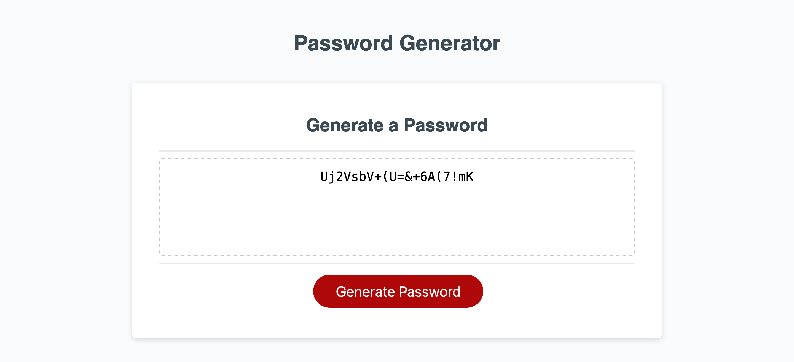

# PasswordGenerator

## MOTIVATION

## REASON FOR PROJECT

AS A user I WANT a password generator that fits certain requirements for password strength. As a user I WANT a password generator that uses numbers, upper and lowercase letters, and special characters to generate a random password.
## PROBLEM-AND-SOLUTION

THE PROBLEM is as a user, I don't want to place much effort into creating a strong random password. THE SOLUTION is creating a password generator that creates a complex random password the fits all password strength requirements.

## DESCRIPTION

THIS SITE contains a password generator when a user clicks the "generate password" button, a series of confirmatory prompts that initiate what character types are used in the password generated.

## SITE ACCESS
SITE: https://brian12345-webdev.github.io/PasswordGenerator/
GITHUB: https://github.com/Brian12345-webdev/PasswordGenerator

